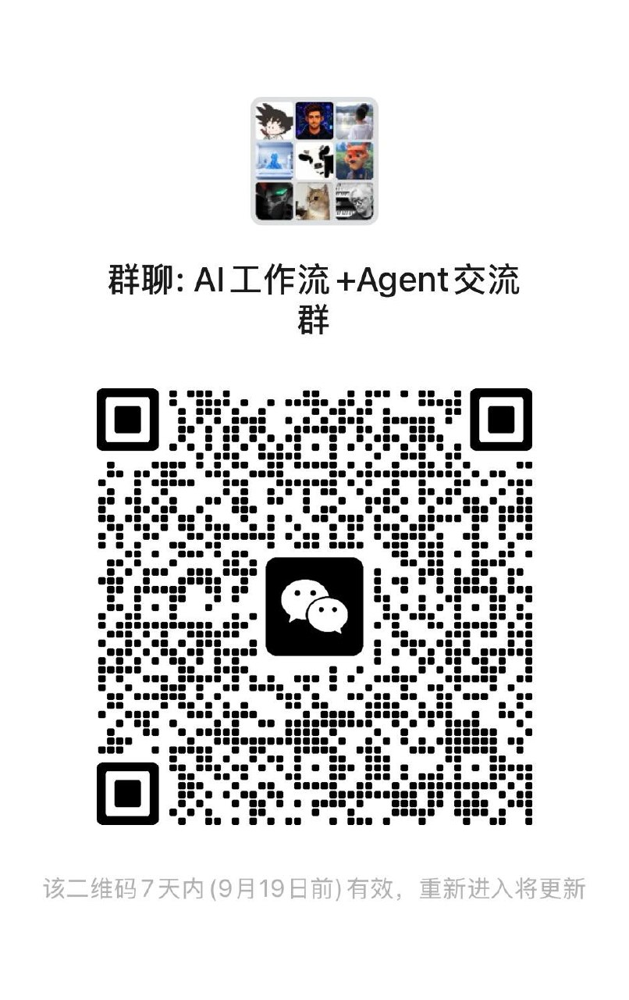

# n8n-nodes-wecom

[](https://www.npmjs.com/package/n8n-nodes-wecom) [](https://github.com/funcodingdev/n8n-nodes-wecom/releases)

这是一个 n8n 社区节点，让你可以在 [n8n](https://n8n.io/) 工作流中使用企业微信（WeChat Work）API。

## ⚠️ 重要提示

> **关于版本更新与稳定性**
>
> 本插件的设计初衷是提供**简单、稳定**的企业微信集成体验。我们以 N8N 官方原生节点（如 Telegram、Notion等）为标准，力求交互逻辑清晰直观。
>
> **开发原则：**
> 我们会审慎评估每一次代码变更，尽量维持现有节点结构和参数的稳定性，避免对生产环境造成不必要的影响。
>
> **注意事项：**
> 在极少数情况下，为了修复重大缺陷或适配企业微信 API 的关键变更，可能会引入必要的调整。
>
> **建议：**
> 生产环境更新前，请查看 [Release 日志](https://github.com/funcodingdev/n8n-nodes-wecom/releases)。如果涉及 Breaking Changes（破坏性变更），我们会显著标记。
>
> **文档说明：**
> 本文档旨在概括插件支持的核心功能。由于企业微信接口众多且更新频繁，本文档可能无法覆盖所有参数细节。遇有疑问，请优先参考 [企业微信官方 API 文档](https://developer.work.weixin.qq.com/document/path/90664)。

## 🤝 交流与支持

遇到问题或有功能建议？欢迎查阅 [企业微信官方文档](https://developer.work.weixin.qq.com/document/path/90664) 或加入我们的交流群。

### 💬 加入社区

|                          方式 1：扫码直接入群                          |                     方式 2：联系作者邀请                     |
| :--------------------------------------------------------------------: | :----------------------------------------------------------: |
|  |  |
|                                 (推荐)                                 |               若群码失效，请备注 **n8n** 拉你                |

### 参与贡献

我们非常欢迎社区贡献！如果你发现了 bug、有新功能建议或想要改进代码：

- **提交 Issue**：[GitHub Issues](https://github.com/funcodingdev/n8n-nodes-wecom/issues) - 报告问题或提出功能建议
- **提交 Pull Request**：[GitHub Pull Requests](https://github.com/funcodingdev/n8n-nodes-wecom/pulls) - 贡献代码改进

无论是代码贡献、文档改进还是功能建议，我们都非常感谢！

---

## 🧩 节点分类

本插件按企业微信官方文档的功能域拆分为 3 个功能节点和 4 个触发器节点。功能节点中的“资源”对应以下分类：

> 📖 **官方文档**：[企业微信服务端 API](https://developer.work.weixin.qq.com/document/path/90664)。可按下方“资源”名称在官方目录中查找对应接口；消息回调可直接查看[接收消息与事件](https://developer.work.weixin.qq.com/document/path/90238)、[第三方应用回调配置](https://developer.work.weixin.qq.com/document/path/91116)和[智能机器人](https://developer.work.weixin.qq.com/document/path/101039)。

### 1. 企业微信-基础

提供基础通信、组织管理、应用与开放能力：

- **消息与会话**：应用消息、群聊会话、消息推送、被动回复、智能机器人被动回复
- **组织与应用**：通讯录管理、应用管理、企业互联、账号 ID
- **内容与安全**：素材管理、文件解密、电子发票、系统信息、安全管理
- **第三方应用**：第三方应用授权、第三方应用接口调用许可、第三方应用收银台、第三方应用推广二维码
- **支付能力**：对外收款、小程序对外收款、企业红包与向员工付款
- **数据能力**：数据与智能专区、会话内容存档

### 2. 企业微信-办公

提供协同办公与组织运营能力：

- **内容协作**：文档、微盘、邮件
- **会议活动**：会议、直播、会议室
- **日常办公**：日程、打卡、审批、汇报
- **组织服务**：人事助手、紧急通知、公费电话

### 3. 企业微信-连接微信

提供企业与微信用户、学校及居民之间的连接能力：

- **客户联系**：客户、标签、继承、客户群、朋友圈、群发与统计
- **微信客服**：客服账号、接待人员、会话分配、消息收发、机器人与统计
- **家校应用**：健康上报、上课直播、班级收款、家校通讯录与网页授权
- **政民沟通**：网格、事件类别、巡查上报与居民上报

### 4. 企业微信消息接收触发器

接收企业微信应用发送的消息及事件回调，包括通讯录、客户联系、上下游、审批、模板卡片等事件。

### 5. 企业微信消息接收（被动回复）触发器

接收企业微信消息，并配合“企业微信-基础”节点的“被动回复”资源在同一次请求中返回回复内容。

### 6. 企业微信第三方应用指令回调触发器

接收第三方应用的授权、通讯录变更、Suite Ticket、应用变更、订单及推广二维码等指令回调。

### 7. 企业微信智能机器人消息接收触发器

接收智能机器人的文本、图片、图文混排、语音、文件、视频等消息，以及进入会话、模板卡片和用户反馈等事件；可配合“智能机器人被动回复”资源使用。

### AI 工具调用审批（Send and Wait）

“企业微信-基础”节点的“消息 → 发送并等待审批”可用于 n8n AI Agent 的人工确认：

- 默认提供“拒绝 / 通过”两个选项，也可配置 1～6 个自定义选项。
- 每个自定义选项可设置按钮文案、唯一返回值、按钮样式，以及是否返回 `approved=true` 允许工具执行。
- URL 按钮模式无需配置消息回调；企业微信原生回调模式可在客户端内完成选择并返回实际操作成员。
- 工作流结果保留 n8n 所需的 `approved`，并额外返回 `selectedOption` 和 `selectedLabel`。
- 原生模式需要启用“企业微信消息接收触发器”的“自动恢复原生 HITL 审批”，且发送、接收凭证必须属于同一企业。

## 🔒 隐私与安全

**本插件完全基于企业微信官方 API 开发，直连企业微信服务器，不经过任何第三方服务器。**

- ✅ **数据直连**：默认所有 API 请求直接发送到企业微信官方服务器 (`qyapi.weixin.qq.com`)
- ✅ **API 代理**：支持配置自定义 API Base URL，适用于需要通过代理访问企业微信 API 的网络环境（默认直连）
- ✅ **无数据缓存**：插件不存储、不缓存任何企业数据或用户信息
- ✅ **无第三方依赖**：不依赖任何第三方数据服务或分析服务
- ✅ **开源透明**：源代码完全开源，可随时审查和验证
- ✅ **本地运行**：所有数据处理均在你的 n8n 实例中进行

你的企业数据安全完全由你的 n8n 实例和企业微信官方平台保障。

## 📦 安装

在 n8n 中通过社区节点管理界面搜索 `n8n-nodes-wecom` 进行安装，或使用命令行：

```bash
npm install n8n-nodes-wecom
```

详细安装指南请参考 [n8n 社区节点文档](https://docs.n8n.io/integrations/community-nodes/installation/)。

## 🔑 凭证配置

### 消息推送凭证（WebHook URL）

**消息推送**功能用于通过群机器人 Webhook 发送消息到企业微信群聊

#### 配置步骤

1. 在企业微信群聊中，点击右上角"..."菜单
2. 选择"群机器人" > "添加机器人"
3. 创建一个机器人并复制 Webhook 地址
4. 在 n8n 中配置"企业微信群机器人 Webhook"凭证，填入 Webhook 地址

### 获取企业微信请求凭证（消息发送、通讯录、素材管理等功能需要）

1. 登录 [企业微信管理后台](https://work.weixin.qq.com/)
2. 进入"我的企业" > "企业信息"，复制 **企业ID (CorpID)**
3. 进入"应用管理" > 选择或创建一个应用
4. 复制 **AgentId**（应用ID）
5. 点击"查看Secret"，复制 **Secret**

### 获取企业微信消息接收凭证

1. 登录 [企业微信管理后台](https://work.weixin.qq.com/)
2. 进入"我的企业" > "企业信息"，复制 **企业ID (CorpID)**
3. 进入"应用管理" > 选择或创建一个应用
4. 启用 **API接收消息**，设置Token、EncodingAESKey
5. 在 n8n 中创建"企业微信消息接收触发器"节点：
   - 配置凭证（企业ID、Token、EncodingAESKey）
   - **Path** 表示 Webhook URL 的路径，建议使用应用 ID
   - 保存节点后，查看生成的 Webhook URL（例如：`https://your-n8n.com/webhook/1000001`）
6. 将 Webhook URL 填入企业微信后台的**接收消息服务器配置**中

**重要提示**：

- 企业微信每个应用只能配置一个接收消息 URL
- 多个工作流可以使用同一个凭证（同一应用ID），它们会共享同一个 Webhook URL 接收消息
- 不同应用请创建不同的凭证，使用不同的应用ID

### 获取企业微信第三方应用指令回调凭证

1. 登录 [企业微信服务商后台](https://open.work.weixin.qq.com/)
2. 进入"应用管理" > "第三方应用"，选择或创建一个第三方应用
3. 复制 **第三方应用ID (SuiteID)**（以ww或wx开头）
4. 在"应用详情" > "开发信息"中，设置**指令回调URL**，配置Token、EncodingAESKey
5. 在 n8n 中创建"企业微信第三方应用指令回调触发器"节点：
   - 配置凭证（第三方应用ID、Token、EncodingAESKey）
   - **Path** 表示 Webhook URL 的路径，建议使用应用相关的唯一标识（例如：`suite/receive`）
   - 保存节点后，查看生成的 Webhook URL（例如：`https://your-n8n.com/webhook/suite/receive`）
6. 将 Webhook URL 填入企业微信服务商后台的**指令回调URL**配置中

**重要提示**：

- 第三方应用的指令回调使用SuiteID作为receiveid（而不是CorpID）
- 服务商收到推送后必须返回字符串 "success"，否则企业微信会把返回内容当作错误信息
- 支持的事件类型：授权变更、通讯录变更、Suite Ticket推送、应用变更等

## 📚 参考资源

- [企业微信开发文档](https://developer.work.weixin.qq.com/document/)
- [企业微信API全局错误码](https://developer.work.weixin.qq.com/document/path/90313)
- [常见问题 - FAQ](https://developer.work.weixin.qq.com/document/path/90315)
- [n8n 官方文档](https://docs.n8n.io/)
- [n8n 社区节点开发文档](https://docs.n8n.io/integrations/creating-nodes/overview/)
- [n8n 社区节点开发示例](https://docs.n8n.io/integrations/creating-nodes/build/declarative-style-node/)

## 📄 许可证

[MIT](LICENSE.md)
